# LDTS_T06_G04 - OVERKILL

## Game Description

Crossy Road is an endless arcade hopper game that derives its name and concept from the age-old “why did the chicken cross the road?” joke. The goal is to move the game character (Chicken) as much time as possible through a hazardous path of busy roads and tree-crowded sidewalks. At the bottom and top of the screen there are two safezones where the difficulty increases every time the character manages to get from one to the other.

This project was developed by Bruno Fernandes (up202108871@edu.fe.up.pt), José Santos (up202108729@edu.fe.up.pt) and Vasco Oliveira (up202108881@edu.fe.up.pt) for LDTS 2022-23.

For a more detailed version of this description click [here](./docs/README.md).

## Screenshots

The following screenshots ilustrate the general look of our game, as well as the divergent functionalities:

### Game preview

  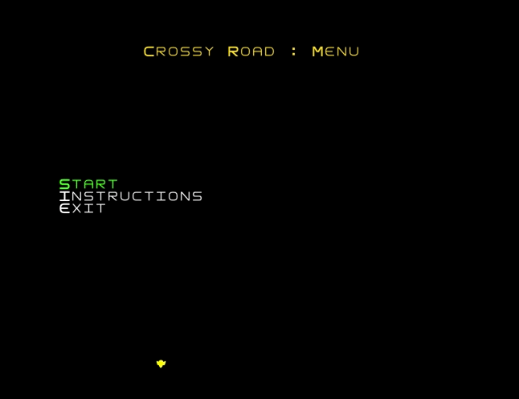

  <b><i>Gif 1. Sneak peak into CROSSY ROAD game</i></b>

 
 

### Menus

  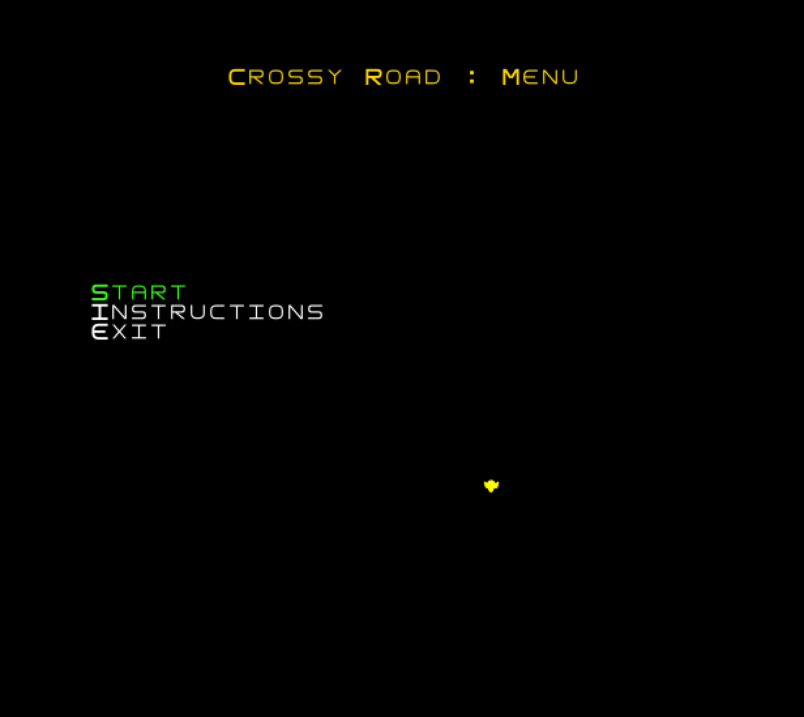

  <b><i>Fig 1. Main Menu </i></b>

  

 
 

  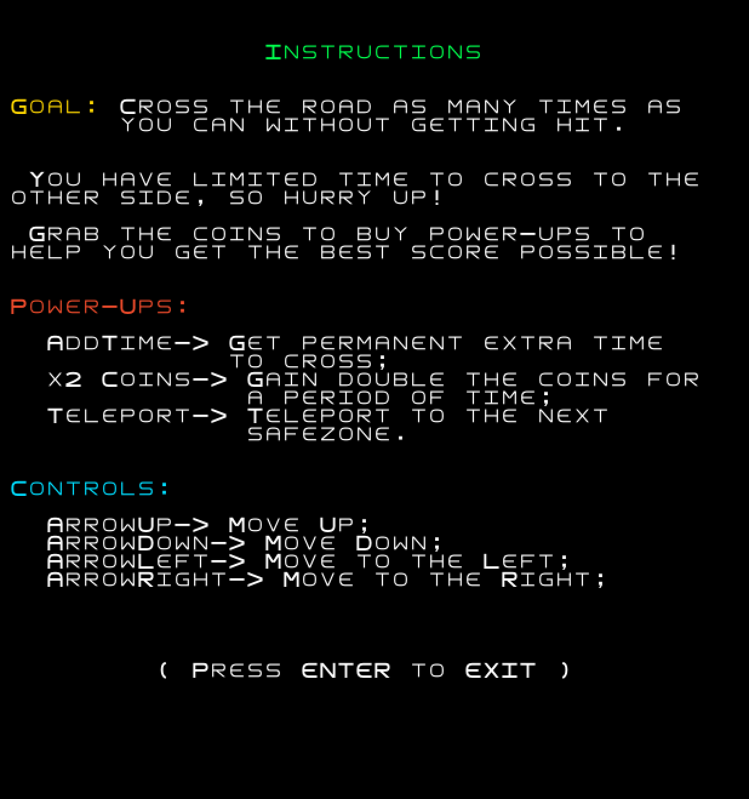

  <b><i>Fig 2. Instructions Menu </i></b>  

  

 
 

  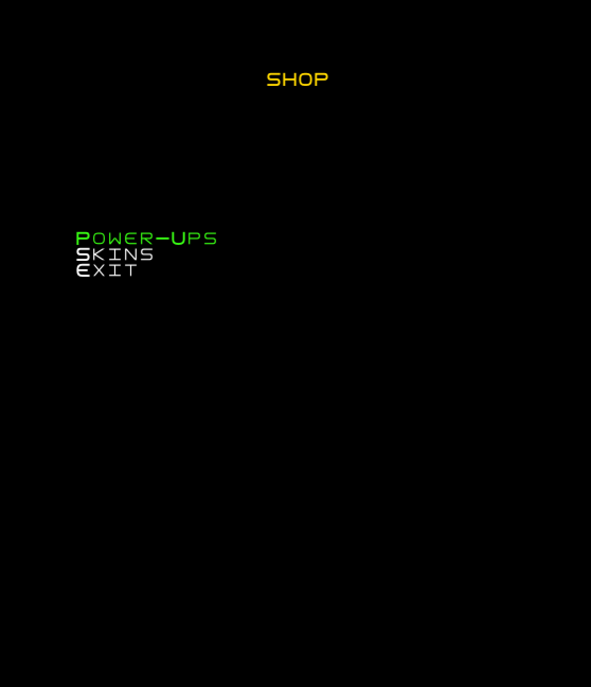

  <b><i>Fig 3. Shop Menu </i></b>

 
 

  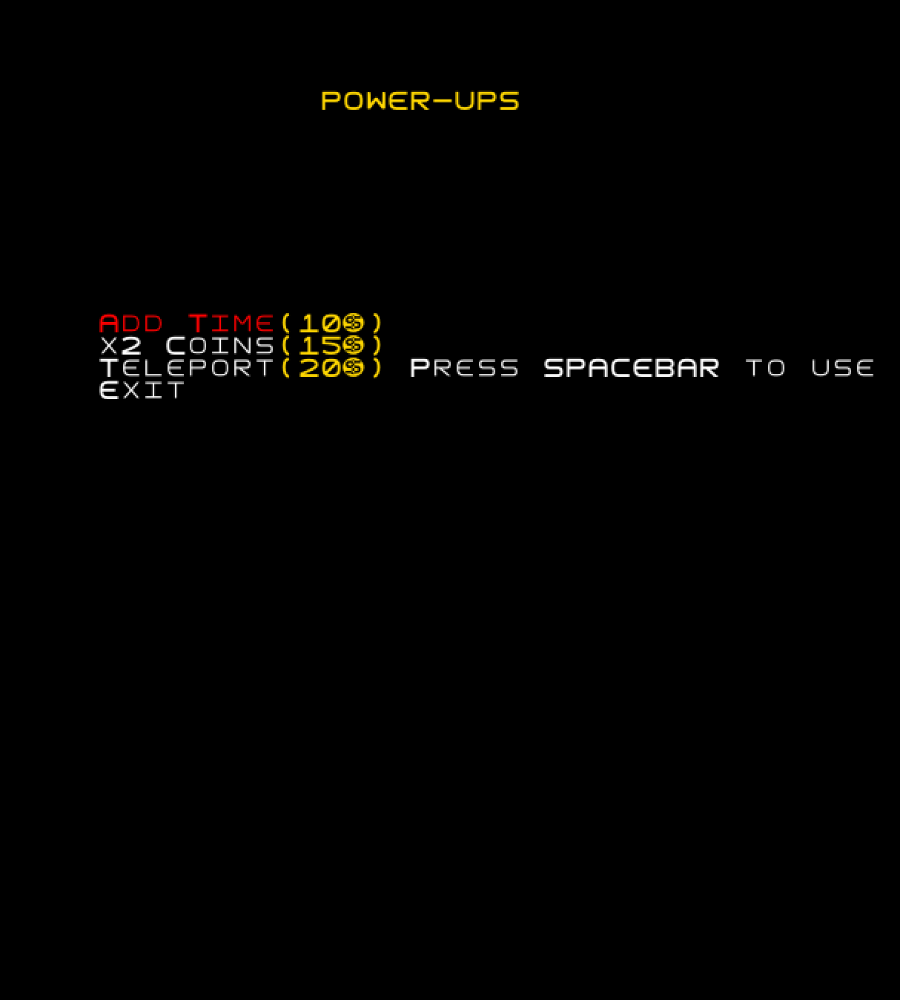

  <b><i>Fig 4. PowerUps Menu </i></b>

 
 

  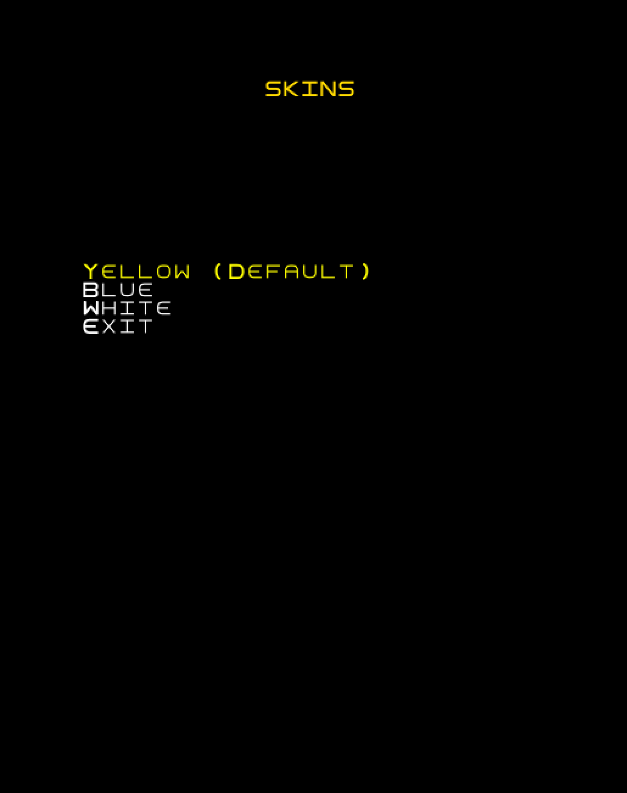

  
  <b><i>Fig 5. Skins Menu </i></b>

 
 

### Animations

  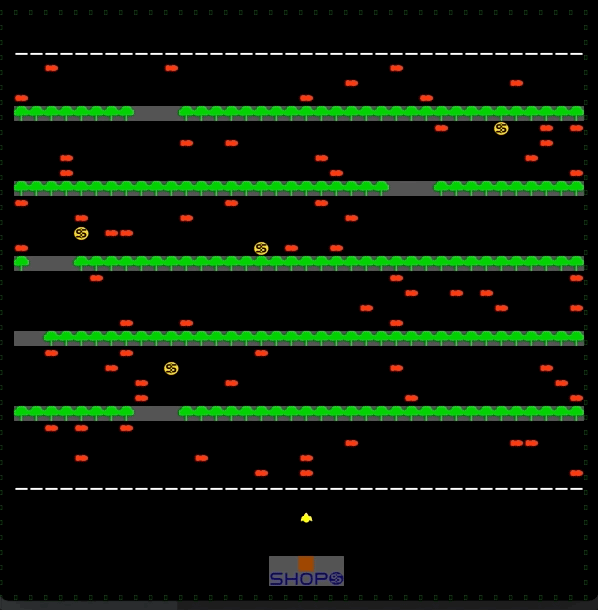

  <b><i>Gif 2. Gameplay </i></b>

 
 

  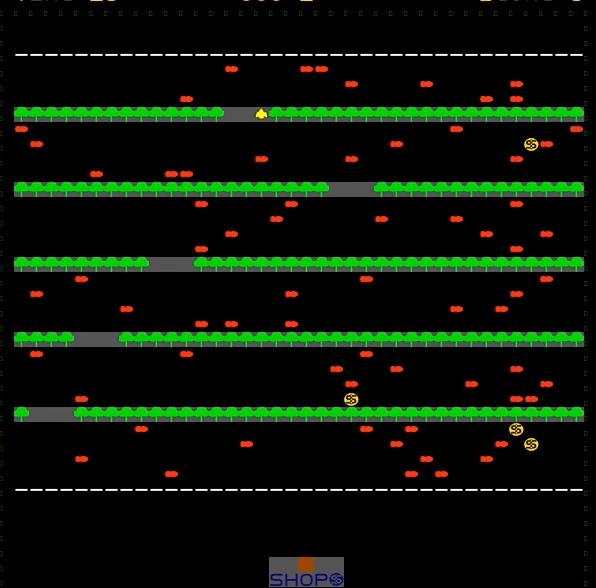

  <b><i>Gif 3. Tree randomizing </i></b>

 
 

  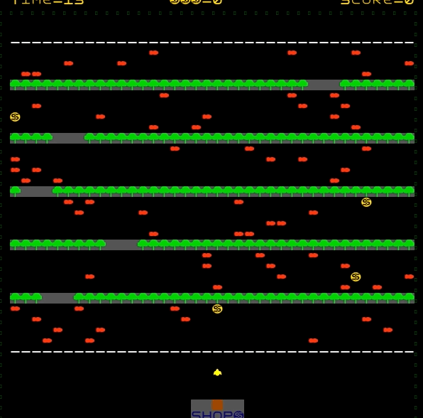

  <b><i>Gif 4. Coin randomizing </i></b>

  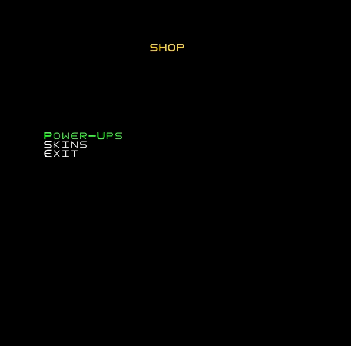

  <b><i>Gif 5. Purchasing powerups </i></b>

 
 

### Play Again

  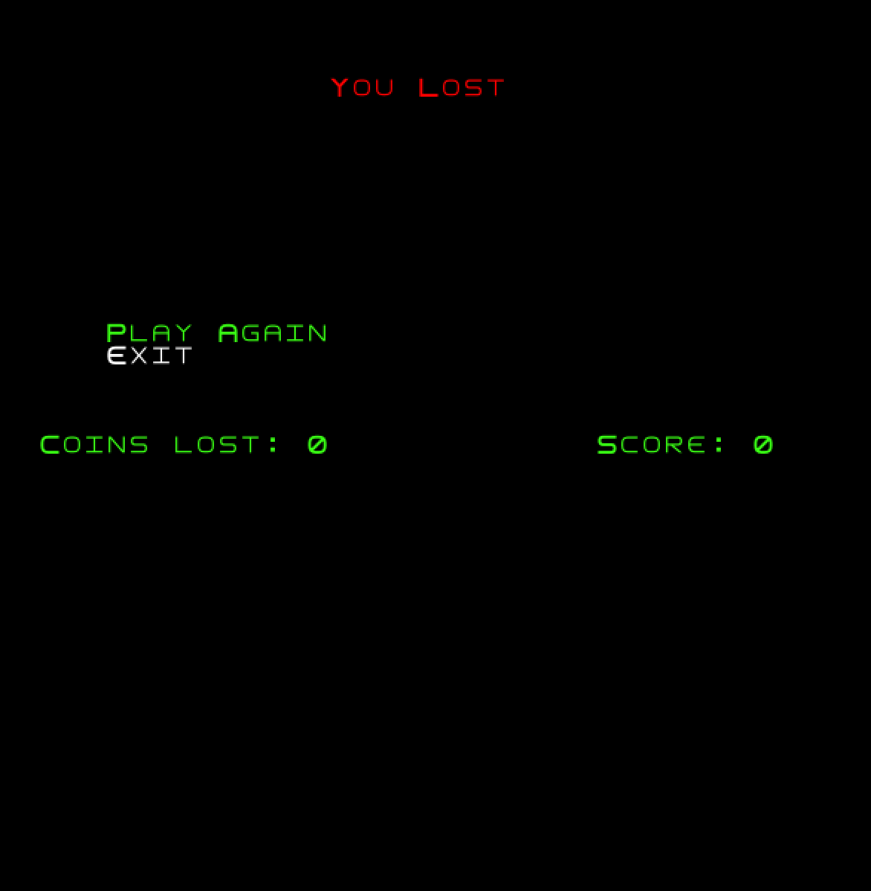

  <b><i>Fig 9. Play Again Menu</i></b>

