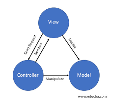
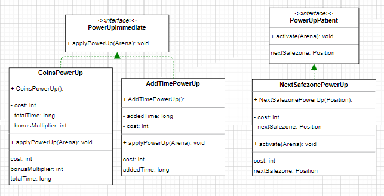
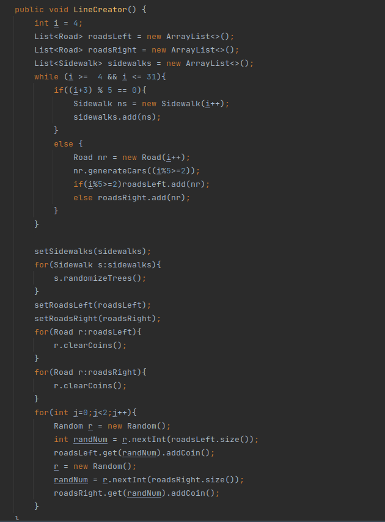
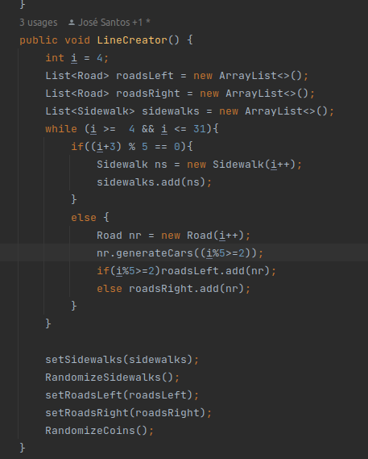
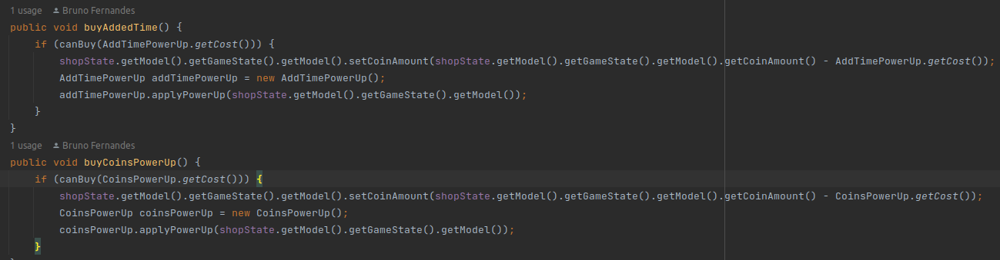
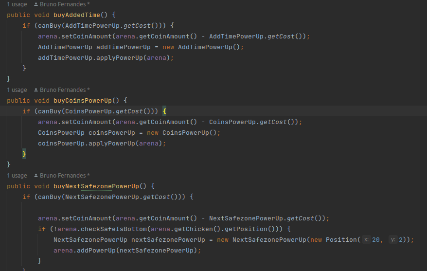
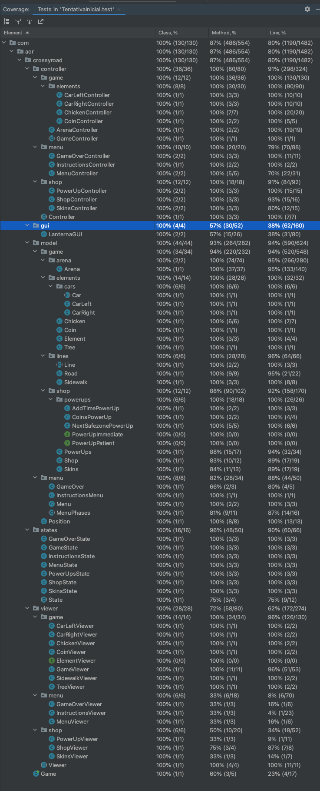

## LDTS_T06_G04 - Crossy Road

Crossy Road is an endless arcade hopper game that derives its name and concept from the age-old “why did the chicken cross the road?” joke. The goal is to move the game character (Chicken) as much time as possible through a hazardous path of busy roads and tree-crowded sidewalks. At the bottom and top of the screen there are two safezones where the difficulty increases every time the character manages to get from one to the other.

This project was developed by Bruno Fernandes (up202108871@edu.fe.up.pt), José Santos (up202108729@edu.fe.up.pt) and Vasco Oliveira (up202108881@edu.fe.up.pt) for LDTS 2022-23.

### Implemented Features

- **Connected Menus** - The user has the power of browsing through the different menus including the ones that can only be accessed in-game. (Ex: Main Menu, Instructions, Shop, PowerUps and Skins).
- **Keyboard Control** - The keyboard inputs are received through the respective events and interpreted according to the current game state.
- **Collisions Detection** - Collisions between different objects are verified. (Ex: Chicken, Cars, Trees, Coins).
- **Moving the Character** - The player can control the character's movements using the arrow keys and use a powerUp when the correct key is pressed. (Ex: the Teleport powerUp can be used using the Spacebar key).
- **Shop Interaction and Money Management** - The player may buy powerUps in the in-game shop and also change the color of the game character.
- **PowerUps** - PowerUps can be purchased in the in-game shop and some are immediately activated whilst others are used upon the pressing of a specific key.
- **Skins** - The player can alter the color of the character. The change doesn't cost any money, even though it's done in the in-game shop.
- **Random Generation of Trees and Cars** - The elements in the map are all randomly generated so every time the game is played the player can have a different experience.
- **Tree and Coin Randomizing** - Every time the player manages to get the character from one safezone to the other the trees randomly change position. Coins randomly change position every 10 seconds.
- **Car Movement** - The cars are always moving, switching sides if they move out of the map.
- **Increasing difficulty** - The cars' speed increases proportionally to the score.

### Planned Features

All the planned features were successfully implemented.

### Design

### General Structure
#### Problem in Context:
The first problem we ran into was how the program would be structured. Considering that our game deals with a GUI and is divided in different game states some patterns sprung to mind.

#### The Pattern:
We applied two key patterns to the project, the **_MVC Architectural Pattern_** (Model-View-Controller style) and the **_State Pattern_** which empowers an object to modify its behavior when its inner state changes.

#### Implementation:
Having implemented these patterns, we ended up with classes with the main purpose of storing data (models), classes controlling the game's logic and physics (controllers) and classes responsible for the game's visual effects (viewers). The association of these types of classes is best described with the following diagram:

  

  <b><i>Fig 1. Model, Controller and Viewer pattern design</i></b>

Regarding the different states, they are split with the same methodology as the MVC style and allow the game to alter its behavior in a simple and efficient manner.

## Consequences:
Using these pattern has the following benefits:
- All the states that embody the different menus become explicit in the code, as an alternative to relying on flags;
- The code acknowledges the SRP (Single Responsiblity Principle).
- Added scalability to the project.

### Different types of PowerUps
#### **Problem in Context**
Initially, we envisioned different types of powerUps that are activated dissimilarly. Some are activated immediately after purchasing them, whilst others are activated upon the press of a certain key. So, basically we were dealing with two different strategies.

#### The Pattern:
We applied the **_Strategy pattern_** which is a behavioral design pattern that allows you to define a family of algorithms, put each of them into a separate class and make their objects interchangeable.

#### Implementation:
Regarding the implementation process, we created two interfaces for two distinct strategies: immediate and patient powerUps. All the powerUps implement one of the interfaces according to their strategy of use.

These interfaces can be found in the following files:
- [PowerUpImmediate](../src/main/java/com/aor/crossyroad/model/game/shop/powerups/PowerUpImmediate.java)
- [PowerUpPatient](../src/main/java/com/aor/crossyroad/model/game/shop/powerups/PowerUpPatient.java)

  

  <b><i>Fig 2. Strategy Pattern UML Diagram</i></b>

#### Consequences:
The **_Strategy Pattern_** has the following consequences:
- You can replace inheritance with composition.
- Open/Closed Principle. You can introduce new strategies without having to change the context.
- If you only have a couple of algorithms and they rarely change, there’s no real reason to overcomplicate the program with new classes and interfaces that come along with the pattern.
- Clients must be aware of the differences between strategies to be able to select the right one.

## Frequenty Used Refactorings
### **_Extract Method_**
Used when there is a code fragment that can be grouped together. The code is moved to a separate new method and the old code is replaced with a call to said method. 

The main reason for this refactoring is the more lines found in a method, the harder it becomes to figure out what the method does.

#### **Example:**

  

  <b><i>Fig 3. Before applying the Extract Method</i></b>

  

  <b><i>Fig 4. After applying the Extract Method</i></b>

### **_Extract Variable_**
Used when there is an expression that is hard to understand. The result of the expression or its parts are placed in separate variables that are self-explanatory.

The main reason for extracting variables is to make a complex expression more understandable, by splitting it into its intermediate parts.

#### **Example:**

  

  <b><i>Fig 5. Before applying the Extract Variable</i></b>

  

  <b><i>Fig 6. After applying the Extract Variable</i></b>

## Known Code Smells And Refactoring Suggestions
#### **Lazy Class**
The [**Coin**](../src/main/java/com/aor/crossyroad/model/game/elements/Coin.java), [**Tree**](../src/main/java/com/aor/crossyroad/model/game/elements/Tree.java), [**CarLeft**](../src/main/java/com/aor/crossyroad/model/game/elements/cars/CarLeft.java) and [**CarRight**](../src/main/java/com/aor/crossyroad/model/game/elements/cars/CarRight.java) classes are examples of lazy classes because the only differences between them are the values passed to the constructor and they don't have any important methods. Nevertheless, we found it justifiable to create them, because we need to be able to discriminate the element, so that we use the correct controller and viewer.
#### **Large Class**
The [**Arena**](../src/main/java/com/aor/crossyroad/model/game/arena/Arena.java) class contains many fields and the [**LanternaGUI**](../src/main/java/com/aor/crossyroad/gui/LanternaGUI.java) class contains many methods. In both cases, we find it well founded as the first one requires these fields, because it is the main class of the program and it needs to store a substantial amount of data. The second class needs all these methods and it wouldn't make sense to split them into two separate classes (extract method).

#### **Data Class**
All model classes are Data Classes, as they contain only fields, and no behavior (dumb classes). This is caused by the **MVC** (Model-View-Controller) architectural pattern which holds the responsibility to the controller to implement the logic functionalities of each model.
This is not a bad code smell because it only exists due to the chosen design pattern.

#### **Refused bequest**
In an attempt to generalize and simplify our code, various abstract classes and interfaces were created. Nevertheless this resulted in the rising of the **Refused bequest** smell. As a result, some subclasses inherited methods from its parent classes which are neither defined nor used. For example, the [**ShopViewer**](../src/main/java/com/aor/crossyroad/viewer/shop/ShopViewer.java) and [**PowerUpViewer**](../src/main/java/com/aor/crossyroad/viewer/shop/PowerUpViewer.java) classes.

#### **Feature envy and message chains**
As the result of the **MVC** (Model-View-Controller) pattern some of the controllers use is narrowed to its model method calls. Our controller envies its model.
Also, in order to access a certain model's parameter it is mandatory to start by making a request to its controller.

## Testing

### Screenshot of coverage report

  

  <b><i>Fig 3. Code coverage screenshot</i></b>

### Link to mutation testing report
[Mutation tests](../build/reports/pitest/)

### Self-evaluation

The work was evenly distributed and we all contributed with our best.

- Bruno Fernandes: 32.5%
- José Santos: 35%
- Vasco Oliveira: 32.5%

